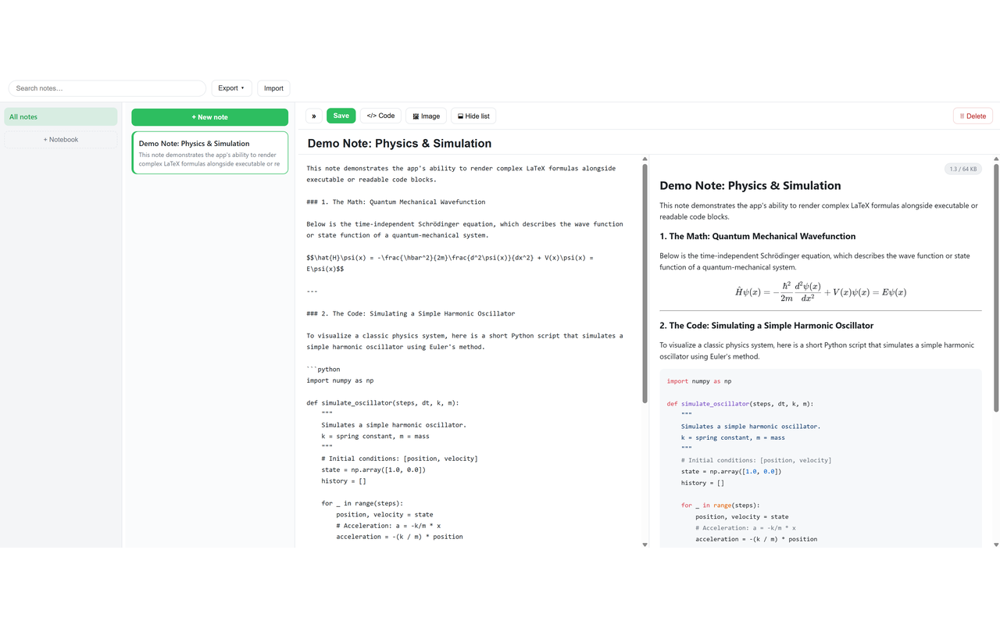
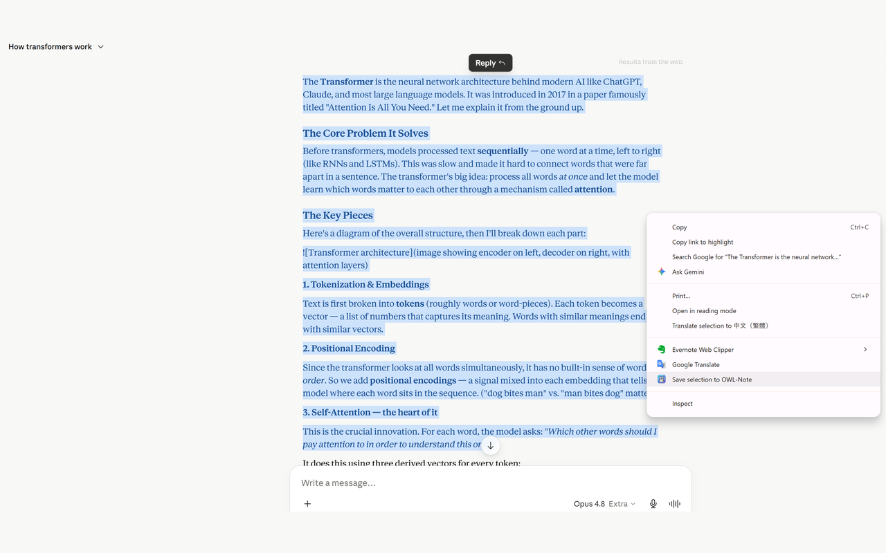

<div align="center">

# 🦉 OWL-Note

### Your notes are browser bookmarks.

**Free, private Markdown notes — with code & math — synced by your own browser account.**
No server. No account. No subscription. No lock-in. A lightweight, no-bloat alternative to Evernote.

[](https://chromewebstore.google.com/detail/hjkbpgkmiaeojfhkpnhmokgjipenhcfl)
[](https://chromewebstore.google.com/detail/hjkbpgkmiaeojfhkpnhmokgjipenhcfl)
[](LICENSE)
[](https://github.com/hinagate/owl-note)

#### [➜ Add to Chrome / Edge — free](https://chromewebstore.google.com/detail/hjkbpgkmiaeojfhkpnhmokgjipenhcfl)



</div>

---

## Why OWL-Note exists

Note apps keep getting heavier and pricier — more features you never asked for, behind subscriptions that climb every year and lock your data in someone else’s cloud.

**OWL-Note is the opposite.** It stores your notes as bookmarks in the browser you already use: no server, no account, no subscription — they sync for free and stay yours. If you just want a fast, clean place to write Markdown (with code and math) that follows you across devices, that’s the whole pitch.

**Built for people who value simplicity and control:**
- Developers and power users who want great code blocks + LaTeX
- Researchers and students who need clean math rendering
- Minimalists tired of feature creep and recurring fees
- Anyone who wants their notes exportable as plain `.md` files anytime (perfect for local LLMs, Obsidian, or archiving)

---

## ✨ What makes it special

- **Notes are bookmarks** — they sync across your devices for free through your existing Google (Chrome) or Microsoft (Edge) account. No server, no account, no subscription, no lock-in.
- **Powerful Markdown** — live preview, syntax-highlighted code blocks, and KaTeX math (inline `$…$` and display `$$…$$`).
- **The home for AI answers** — paste a ChatGPT/Claude/Gemini reply and it stays formatted, or **right-click any selection → “Save selection to OWL-Note”** to clip it from any page.
- **Search without opening the app** — notes are real bookmarks, so you can find them straight from the browser address bar.
- **Import & export, no lock-in** — bring in Word (`.docx`), Evernote (`.enex`), and Markdown; export everything to a zip of plain `.md` files anytime.
- **Bulk actions, with a safety net** — multi-select like files (Ctrl/Cmd-click, Shift+↑/↓) and a **Trash** you can restore from.
- **Private by design** — no backend, no telemetry; we run no server and never see your notes. Minimal permissions, built on Manifest V3.
- **Your work is safe** — auto-saves as you type, with a compressed local backup on every device, so nothing is lost even if a bookmark goes missing.

<p align="center">
  
  <br><sub><em>Right-click any selection → “Save selection to OWL-Note.”</em></sub>
</p>

---

## 🚀 Get started (10 seconds)

1. Install **OWL-Note** from the [Chrome Web Store](https://chromewebstore.google.com/detail/hjkbpgkmiaeojfhkpnhmokgjipenhcfl)
2. (Optional but recommended) Pin the extension
3. Click the icon and start writing

Works on Google Chrome, Microsoft Edge, and other Chromium-based browsers.  
On Edge, first enable “Allow extensions from other stores” in `edge://extensions`.

---

## How it works

OWL-Note doesn’t invent its own storage or sync system. It uses what your browser already provides:

1. You write clean Markdown in the app (with code blocks and math).
2. The note is compressed and saved as a bookmark inside a dedicated folder in your browser’s bookmarks.
3. Your browser’s built-in account sync (Google or Microsoft) replicates it to your other signed-in devices.
4. A local backup copy is also kept on each device for safety.

That’s why it’s so lightweight and private — we’re not building another cloud service. We’re just making excellent use of infrastructure you already have and that Google/Microsoft continue to harden.

---

## Good to know

- Built for text notes — Markdown, code, and math. Very large notes (e.g. with big images) stay on the current device instead of syncing.
- Works on Chrome, Edge, and other Chromium browsers.

---

## For developers & contributors

```bash
npm install
npm test
npm run build
```

Load the `dist/` folder as an unpacked extension at `chrome://extensions` (or `edge://extensions`).

### Stable extension ID

Notes reference `chrome-extension://<ID>/…`, so the extension ID should stay consistent across installs. If it changes (e.g. a fresh unpacked load), the app self-heals note URLs to the current ID on launch.

### Measuring real sync limits

A small `tools/sync-probe` utility finds the actual safe size ceiling on your devices — run it once across two synced devices to set `WARN_URL_BYTES` / `MAX_URL_BYTES`.

---

**OWL-Note** — because your notes should belong to you, not the other way around.

Install it. Try it for a day. If you love simple, private, and truly yours note-taking, you’ll feel right at home.

[➜ Add to Chrome / Edge](https://chromewebstore.google.com/detail/hjkbpgkmiaeojfhkpnhmokgjipenhcfl)  
[View source on GitHub](https://github.com/hinagate/owl-note)

