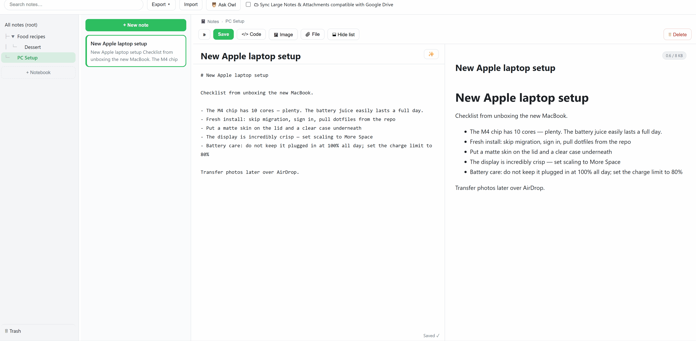
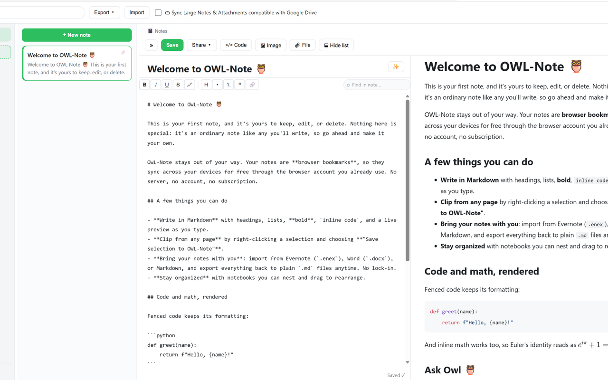
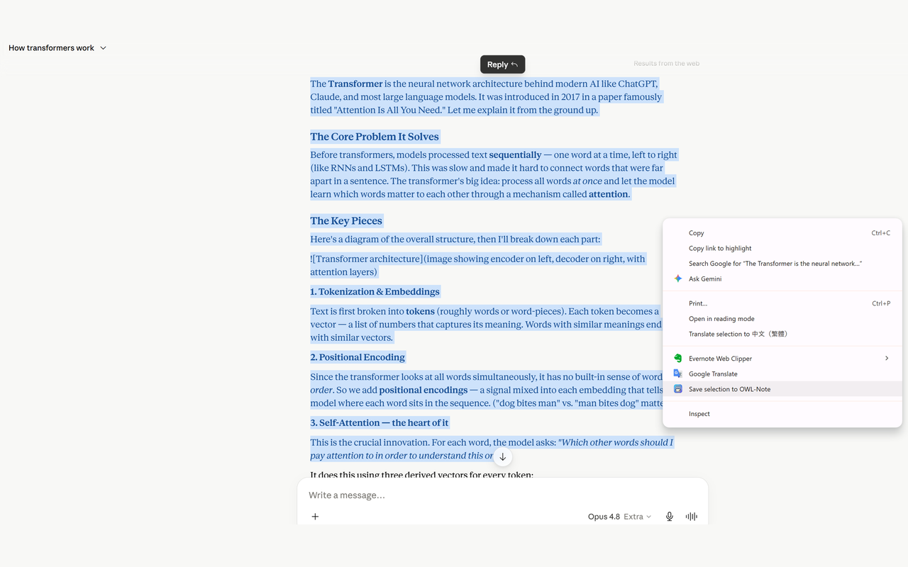

<div align="center">

# 🦉 OWL-Note

### Your notes are browser bookmarks. Your AI runs on your device.

**Free, private Markdown notes — with code & math — synced by your own browser account.**
Now with **Ask Owl**: answers from your own notes, powered by **Google Gemini Nano** / **Microsoft Phi** — entirely on-device.
No server. No account. No subscription. No lock-in. A lightweight, no-bloat alternative to Evernote.

[](https://chromewebstore.google.com/detail/hjkbpgkmiaeojfhkpnhmokgjipenhcfl)
[](https://chromewebstore.google.com/detail/hjkbpgkmiaeojfhkpnhmokgjipenhcfl)
[](LICENSE)
[](https://github.com/hinagate/owl-note)

#### [➜ Add to Chrome / Edge — free](https://chromewebstore.google.com/detail/hjkbpgkmiaeojfhkpnhmokgjipenhcfl)





</div>

---

## Why OWL-Note exists

Note apps keep getting heavier and pricier — more features you never asked for, behind subscriptions that climb every year and lock your data in someone else’s cloud.

**OWL-Note is the opposite.** It stores your notes as bookmarks in the browser you already use: no server, no account, no subscription — they sync for free and stay yours. If you just want a fast, clean place to write Markdown (with code and math) that follows you across devices, that’s the whole pitch.

**Built for people who value simplicity and control:**
- Developers and power users who want great code blocks + LaTeX
- Researchers and students who need clean math rendering
- Minimalists tired of feature creep and recurring fees
- Anyone who wants their notes exportable as plain `.md` files anytime (perfect for local LLMs, Obsidian, or archiving)

---

## 🦉 New: Ask Owl — it only knows your OWN notes

Ask Owl a question in plain language and it answers **from your notes and nothing else** — with citations that jump straight to the source. Under the hood: **Google Gemini Nano** (Chrome) or **Microsoft Phi** (Edge) — the same compact frontier models your browser ships built-in — plus a retrieval engine that understands **meaning, not just keywords**. All of it runs on your device.

- **Chat with your own wisdom** — a real conversation thread: ask Owl, follow up, start a new chat. Works in your language, CJK included.
- **Answers with receipts** — every answer cites the notes it came from, and related notes are one click away, even across notebooks.
- **Finds what you *mean*** — optional semantic search matches "what do I pay for housing?" to a note that only ever says "rent: $1,400". One click builds it: a one-time ~130 MB on-device model download, then it's yours forever. On our benchmark corpus, this lifted recall on paraphrased questions from 45% to 100% ([measured, not vibes](eval/RESULTS.md)).
- **One-click note tools** — **Summarize** the open note, **Tidy** its Markdown formatting (deterministic — it never rewrites your words), or let the AI **suggest a title**.
- **The privacy absolute** — the AI runs **on your device**. Your questions and notes are never sent to any server: not ours (we don't run one), not Google's, not anyone's. Once the models are downloaded, everything — search, answers, summaries — works **fully offline**.

*AI answers need a browser with built-in AI (recent Chrome/Edge on supported hardware). Everywhere else, Ask Owl still gives you fast, meaning-aware excerpt search over every note.*

---

## ✨ What makes it special

- **Notes are bookmarks** — they sync across your devices for free through your existing Google (Chrome) or Microsoft (Edge) account. No server, no account, no subscription, no lock-in.
- **Powerful Markdown** — live preview, syntax-highlighted code blocks, and KaTeX math (inline `$…$` and display `$$…$$`).
- **The home for AI answers** — paste a ChatGPT/Claude/Gemini reply and it stays formatted, or **right-click any selection → “Save selection to OWL-Note”** to clip it from any page.
- **Search without opening the app** — notes are real bookmarks, so you can find them straight from the browser address bar.
- **Import & export, no lock-in** — bring in Word (`.docx`), Evernote (`.enex`), and Markdown; export everything to a zip of plain `.md` files anytime.
- **Bulk actions, with a safety net** — multi-select like files (Ctrl/Cmd-click, Shift+↑/↓) and a **Trash** you can restore from.
- **Nested notebooks** — organize notes into notebooks and sub-notebooks in a collapsible tree, drag to re-nest, and a breadcrumb always shows which notebook the open note lives in.
- **Ask Owl** — on-device AI Q&A that only knows your OWN notes, with citations, plus one-click Summarize / Tidy / title suggestions (see above). Even the AI never phones home.
- **Private by design** — no backend, no telemetry; we run no server and never see your notes. Minimal permissions, built on Manifest V3. ([Full privacy policy](PRIVACY.md))
- **Attach images & files** — paste or drop in images, or attach any file (PDF, Word, zip…) right inside a note.
- **Optional Google Drive sync** — flip one toggle to also sync your attachments *and* any note too large to fit in a bookmark through **your own** Google Drive, so nothing stays stuck on a single device. Off by default — we still run no server and never see your notes.
- **Your work is safe** — auto-saves as you type, with a compressed local backup on every device, so nothing is lost even if a bookmark goes missing.

<p align="center">
  
  <br><sub><em>Right-click any selection → “Save selection to OWL-Note.”</em></sub>
</p>

---

## 🚀 Get started (10 seconds)

1. Install **OWL-Note** from the [Chrome Web Store](https://chromewebstore.google.com/detail/hjkbpgkmiaeojfhkpnhmokgjipenhcfl)
2. (Optional but recommended) Pin the extension
3. Click the icon and start writing

Works on Google Chrome, Microsoft Edge, and other Chromium-based browsers.  
On Edge, first enable “Allow extensions from other stores” in `edge://extensions`.

---

## How it works

OWL-Note doesn’t invent its own storage or sync system. It uses what your browser already provides:

1. You write clean Markdown in the app (with code blocks and math).
2. The note is compressed and saved as a bookmark inside a dedicated folder in your browser’s bookmarks.
3. Your browser’s built-in account sync (Google or Microsoft) replicates it to your other signed-in devices.
4. A local backup copy is also kept on each device for safety.

**Optional — Google Drive sync.** Turn on one toggle and OWL-Note *additionally* stores image/file attachments and any note too large to fit in a bookmark in an `OWL-Note Sync` folder in **your own** Google Drive — so those sync across your devices too. It’s keyed to your Google account, off by default, and we never see it. Everything else works exactly as above.

That’s why it’s so lightweight and private — we’re not building another cloud service. We’re just making excellent use of infrastructure you already have and that Google/Microsoft continue to harden.

---

## 🔬 Engineering highlights

Ask Owl is unusual: almost every "AI feature" is a wrapper around a cloud API, but here the **whole AI stack is local** — generation on the browser's built-in model, semantic search on a bundled WASM embedding runtime, no API keys, no server, no per-query cost. Once the models are on the device it works **fully offline — try it in airplane mode.** For the full decision log, see [ARCHITECTURE.md](ARCHITECTURE.md); for the measured numbers, [eval/RESULTS.md](eval/RESULTS.md).

- **Measured retrieval, not vibes.** A committed golden set of 47 questions over a synthetic corpus gates retrieval in CI. Hybrid search lifted paraphrase recall@5 from **0.455 → 1.000** (recall *saturates* on this small corpus, so MRR is the sensitive metric — caveats travel with every number).
- **Multilingual (CJK) by design.** A superset tokenizer emits character bigrams for Han/Kana/Hangul runs so unspaced Chinese/Japanese/Korean notes are searchable, with Latin behavior byte-identical. The embedding model was chosen by **multilingual MRR**, not recall — the English-centric candidate ranked non-Latin scripts poorly.
- **Prompt-injection defense in depth.** Note content is untrusted input: sentinel-wrapped chunks with marker neutralization on title/heading/body, chunk-id sanitization at minting so a forged citation can't round-trip, and an injection subset in the eval that keeps resistance a *measured* metric.
- **On-device + offline architecture.** Manifest V3 with the ONNX Runtime WASM **bundled** (remote code is forbidden; weights are data), a consent-gated one-time model download, IndexedDB vector persistence with embed-once-sync-forever hash diffing, and a degradation ladder (model → snippets → lexical) for machines with no local model.
- **Eval-gated feature decisions.** Feasibility was measured *before* the semantic layer was built, and features were **dropped on evidence** — a generative reformatter and an LLM-as-classifier both failed pre-declared criteria and were cut.

---

## Good to know

- By default, notes sync as bookmarks; a note too large for that (e.g. with big images or lots of text) stays on the current device. Turn on **Google Drive sync** (optional) and those sync too, via your own Drive.
- **AI features are strictly opt-in and on-device.** Answers use your browser's built-in model — Google Gemini Nano on Chrome, Microsoft Phi on Edge (a one-time browser-managed download, offered only when you click Enable). Semantic search is a separate one-time ~130 MB on-device model, downloaded only when you click Build. Neither ever sends your notes anywhere; both keep working offline afterwards.
- On devices without built-in browser AI, Ask runs in retrieval-only mode — still a great meaning-aware search.
- Works on Chrome, Edge, and other Chromium browsers.

---

## For developers & contributors

```bash
npm install
npm test
npm run build
```

Load the `dist/` folder as an unpacked extension at `chrome://extensions` (or `edge://extensions`).

### Stable extension ID

Notes reference `chrome-extension://<ID>/…`, so the extension ID should stay consistent across installs. If it changes (e.g. a fresh unpacked load), the app self-heals note URLs to the current ID on launch.

### Measuring real sync limits

A small `tools/sync-probe` utility finds the actual safe size ceiling on your devices — run it once across two synced devices to set `WARN_URL_BYTES` / `MAX_URL_BYTES`.

---

**OWL-Note** — because your notes should belong to you, not the other way around.

Install it. Try it for a day. If you love simple, private, and truly yours note-taking, you’ll feel right at home.

[➜ Add to Chrome / Edge](https://chromewebstore.google.com/detail/hjkbpgkmiaeojfhkpnhmokgjipenhcfl)  
[View source on GitHub](https://github.com/hinagate/owl-note)

